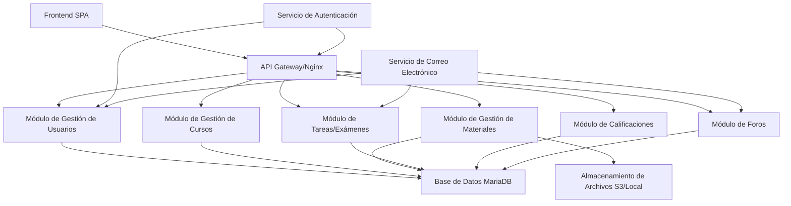

# Informe del Proyecto: Aplicación Web al Estilo de Moodle para Gestión de Estudiantes

## 1. Análisis de Requisitos

### Requisitos Funcionales
Basado en el concepto de sistema de gestión de aprendizaje (LMS) al estilo de Moodle, la aplicación debe apoyar flujos de trabajo educativos principales. Los requisitos funcionales se categorizan por roles de usuario y procesos clave.

- **Gestión de Usuarios**:
  - Registro: Los usuarios (estudiantes, profesores, administradores) se registran con correo electrónico, contraseña y detalles personales (nombre, institución). La validación de correo electrónico es obligatoria para prevenir cuentas falsas.
  - Autenticación: Inicio de sesión seguro usando nombre de usuario/correo electrónico y contraseña. Soporte para autenticación de dos factores (2FA) usando TOTP (Contraseña de Un Solo Uso Basada en Tiempo) para mayor seguridad.
  - Acceso Basado en Roles: Tres roles principales – Estudiantes (ver/inscribirse en cursos, acceder a materiales, enviar tareas), Profesores (crear/gestionar cursos, subir materiales, calificar trabajos), Administradores (gestionar usuarios, supervisar el sistema).
  - Gestión de Perfil: Los usuarios actualizan información personal, cambian contraseñas y gestionan configuraciones de 2FA.

- **Gestión de Cursos**:
  - Creación de Cursos: Los profesores crean cursos con títulos, descripciones, horarios y límites de inscripción.
  - Proceso de Inscripción: Los estudiantes navegan y solicitan inscripción; profesores/administradores aprueban. Opciones de auto-inscripción para cursos abiertos.
  - Visualización de Cursos: Listas de cursos disponibles e inscritos, con búsqueda y filtrado.

- **Acceso a Materiales y Subidas de Archivos**:
  - Subir Materiales: Los profesores suben documentos, videos, enlaces, etc., con metadatos (título, descripción).
  - Reglas de Visibilidad: Establecer niveles de acceso – público (todos los usuarios), inscrito (participantes del curso), privado (usuarios/grupos específicos).
  - Control de Acceso: Los estudiantes ven/descargan materiales basados en permisos; profesores editan/borran.

- **Tareas y Exámenes**:
  - Creación: Los profesores crean tareas/exámenes con fechas límite, instrucciones y adjuntos de archivos.
  - Envío: Los estudiantes envían trabajos (texto, archivos) antes de las fechas límite.
  - Calificación: Los profesores revisan envíos, asignan calificaciones y proporcionan retroalimentación/comentarios.

- **Sistema de Calificaciones**:
  - Cálculo de Calificaciones: Computación automática de promedios, puntuaciones ponderadas y calificaciones finales.
  - Visualización: Los estudiantes acceden a calificaciones individuales y de curso; profesores ven el rendimiento de la clase.

- **Características Adicionales**:
  - Notificaciones: Alertas para fechas límite, calificaciones, nuevos materiales.
  - Búsqueda y Navegación: Búsqueda global para cursos, materiales, usuarios.
  - Foros: Foros dedicados para cada curso o materia, así como foros separados para cada unidad, para facilitar la discusión y el intercambio de ideas entre estudiantes y profesores de manera organizada.

### Requisitos No Funcionales
- **Rendimiento**: Manejar 1,000+ usuarios concurrentes con tiempos de respuesta bajo 2 segundos para la mayoría de operaciones.
- **Seguridad**: Proteger contra amenazas comunes; asegurar integridad y confidencialidad de datos.
- **Usabilidad**: Interfaz intuitiva, responsiva accesible en escritorio/móvil; soporte para múltiples idiomas.
  - Diseño Responsivo: Mobile-first con Bootstrap/Tailwind.
  - Navegación Intuitiva: Dashboards, breadcrumbs, búsqueda global.
  - Notificaciones: In-app y email para actualizaciones.
  - Seguimiento de Progreso: Barras de progreso visuales para cursos/tareas.
  - Accesibilidad: Cumplimiento WCAG 2.1, soporte para lectores de pantalla.
  - Mecanismos de Retroalimentación: Encuestas, integración de helpdesk.
- **Escalabilidad**: Diseño modular para agregar características/usuarios sin rework mayor.
- **Fiabilidad**: 99.9% uptime, con mecanismos de respaldo y recuperación.
- **Cumplimiento**: Adherirse a leyes de protección de datos como GDPR (si aplica para la base de usuarios).
- **Mantenibilidad**: Código limpio, documentación y pruebas automatizadas.

## 2. Diseño de Arquitectura
Se propone una arquitectura modular, inspirada en microservicios para asegurar escalabilidad, mantenibilidad y despliegue independiente de características. Cada módulo es una aplicación/componente separada, interactuando vía APIs RESTful y una base de datos compartida para consistencia de datos.

### Componentes de Alto Nivel
- **Frontend**: Aplicación de página única (SPA) para interacciones de usuario.
- **Módulos Backend**: Servicios separados para cada dominio (ej. gestión de usuarios como una app Django).
- **Base de Datos**: Base de datos relacional centralizada para datos compartidos.
- **Servicio de Autenticación**: Maneja inicio de sesión, 2FA y gestión de sesiones.
- **Almacenamiento de Archivos**: Almacenamiento seguro para subidas, integrado con backend.
- **API Gateway/Proxy Inverso**: Enruta solicitudes, maneja SSL y balanceo de carga.
- **Servicios Externos**: Correo electrónico para notificaciones, posiblemente terceros para 2FA.

### Interacciones de Módulos
- Los módulos se comunican vía APIs HTTP (REST) para acoplamiento suelto.
- Base de Datos Compartida: MariaDB para datos relacionales; módulos consultan/actualizan vía ORM.
- Orientado a Eventos: Usar colas de mensajes (ej. RabbitMQ) para tareas asíncronas como notificaciones.
- Manejo de Archivos: Subidas directas a almacenamiento, metadatos almacenados en DB.

### Diagrama de Alto Nivel

Esta arquitectura permite escalado horizontal de módulos y actualizaciones fáciles.

## 3. Desglose de Módulos
Cada módulo es una unidad autocontenida con responsabilidades y dependencias definidas.

- **Módulo de Gestión de Usuarios**:
  - Responsabilidades: Registro de usuarios, autenticación, gestión de perfil, asignación de roles.
  - Dependencias: Ninguna (módulo core).
  - Tecnologías: App Django con API REST.
  - **Implementación Completada**:
    - Serializers: UserSerializer, UserRegistrationSerializer, UserLoginSerializer, UserUpdateSerializer, ChangePasswordSerializer, TwoFactorSetupSerializer, TwoFactorVerifySerializer con validación completa.
    - Vistas: RegisterView, LoginView (con soporte 2FA), LogoutView, TwoFactorSetupView, TwoFactorVerifyView, ProfileView, ChangePasswordView, UserListView, UserDetailView.
    - URLs: Endpoints RESTful para todas las operaciones de usuario (/api/auth/).
    - Seguridad: JWT authentication, django-axes para protección contra fuerza bruta, django-ratelimit para limitación de tasa, django-auditlog para logging de auditoría, django-redis para caché.
    - Pruebas: Cobertura completa con 350+ líneas de tests unitarios incluyendo autenticación, gestión de perfil, 2FA, seguridad y administración.

- **Módulo de Gestión de Cursos**:
  - Responsabilidades: Creación de cursos, inscripción, visualización.
  - Dependencias: Gestión de Usuarios (para roles/permisos).
  - Tecnologías: App Django.

- **Módulo de Gestión de Materiales**:
  - Responsabilidades: Subidas de archivos, control de acceso, configuraciones de visibilidad.
  - Dependencias: Gestión de Cursos, Gestión de Usuarios.
  - Tecnologías: Django con bibliotecas de manejo de archivos.

- **Módulo de Tareas/Exámenes**:
  - Responsabilidades: Crear/enviar/calificar tareas/exámenes.
  - Dependencias: Gestión de Cursos, Gestión de Usuarios.
  - Tecnologías: Django.

- **Módulo de Calificaciones**:
  - Responsabilidades: Calcular y mostrar calificaciones.
  - Dependencias: Módulo de Tareas/Exámenes, Gestión de Usuarios.
  - Tecnologías: Django con lógica de cálculo.

- **Módulo de Foros**:
  - Responsabilidades: Crear y gestionar foros por curso y unidad, publicar mensajes, moderar discusiones.
  - Dependencias: Gestión de Cursos, Gestión de Usuarios.
  - Tecnologías: Django.

Este desglose asegura modularidad; nuevos módulos pueden agregarse sin afectar otros.

## 4. Recomendaciones de Stack Tecnológico
Comenzando con Django y MariaDB como sugerido, evaluado para ajuste.

- **Backend**: Django (Python) – Framework full-stack con ORM, autenticación e interfaz de admin. Adecuado para desarrollo rápido de LMS. Alternativa: FastAPI para mayor rendimiento si demandas de escalabilidad aumentan.
- **Base de Datos**: MariaDB – Open-source, compatible con MySQL, confiable para datos relacionales. Alternativa: PostgreSQL para características avanzadas como soporte JSON si necesario.
- **Frontend**: React – Basado en componentes, eficiente para SPAs, bueno para interfaces dinámicas de LMS. Alternativa: Vue.js para curva de aprendizaje más simple.
- **Despliegue/Containerización**: Docker y Docker Compose para portabilidad. Kubernetes para escalado en producción.
- **Otras Herramientas**: Nginx para proxy inverso, Redis para caché/sesiones, Celery para tareas asíncronas.
- **Justificación**: Django reduce boilerplate para características de usuario/auth. MariaDB es costo-efectivo y familiar. React asegura UX responsiva. Alternativas elegidas para mejor escalabilidad/seguridad si la base de usuarios crece más allá de estimaciones iniciales.

## 5. Medidas de Seguridad
Seguridad integral para proteger usuarios y datos.

- **Autenticación**: Hashing de contraseñas (bcrypt), validación de correo electrónico, 2FA (TOTP vía bibliotecas como django-otp).
- **Autorización**: Control de Acceso Basado en Roles (RBAC) con permisos (ej. estudiantes no pueden editar cursos).
- **Encriptación de Datos**: TLS 1.3 para transporte, AES-256 para datos sensibles en reposo.
- **Prevención de Ataques**: Validación/sanitización de entrada, tokens CSRF, limitación de tasa (ej. vía Nginx), protección contra inyección SQL vía ORM.
- **Subidas de Archivos Seguras**: Validación de tipo/tamaño de archivo, escaneo de virus, almacenamiento en directorios aislados.
- **Cumplimiento**: Adherirse a guías OWASP, auditorías de seguridad regulares.
- **Limitación de Tasa**: Implementar en APIs para prevenir DDoS.
- **Logging de Auditoría**: Loggear todas las acciones de usuario para forense.
- **Pruebas de Penetración**: Pruebas trimestrales por expertos.
- **Codificación Segura**: Revisiones de código obligatorias, uso de bibliotecas de seguridad.
- **Monitoreo**: Alertas en tiempo real vía herramientas como ELK stack o Prometheus.

## 6. Protección de Datos
Enfoque en privacidad y cumplimiento legal.

- **Manejo de Datos Personales**: Recopilar datos mínimos (nombre, correo electrónico, calificaciones); consentimiento de usuario requerido para procesamiento.
- **Políticas de Privacidad**: Políticas claras, accesibles con opciones de opt-out.
- **Retención de Datos**: Retener datos según necesario (ej. calificaciones indefinidamente para transcripciones), borrar a solicitud de usuario o expiración legal.
- **Medidas de Protección**: Encriptación, logs de acceso, anonimización para analytics.
- **Cumplimiento GDPR**: Portabilidad de datos, derecho a borrado, notificación de brechas.

## 7. Plan de Despliegue
Usando Docker Compose para entornos.

- **Entornos**: Producción (www.sverina.com.ar), Prueba/Dev (dev.sverina.com.ar).
- **Configuración Docker Compose**:
  - Servicios: Uno por módulo (apps Django), MariaDB, Nginx (proxy inverso), Redis (opcional).
  - Redes: Internas para módulos, puertos expuestos para Nginx.
  - Volúmenes: Persistentes para DB y almacenamiento de archivos.
- **Certificados SSL**: Let's Encrypt vía Certbot para HTTPS automático.
- **Variables de Entorno**: Almacenar secretos (contraseñas DB, claves API) en archivos .env, no en código.
- **CI/CD**: GitHub Actions para pruebas automatizadas, construcción de imágenes y despliegue a servidores.
