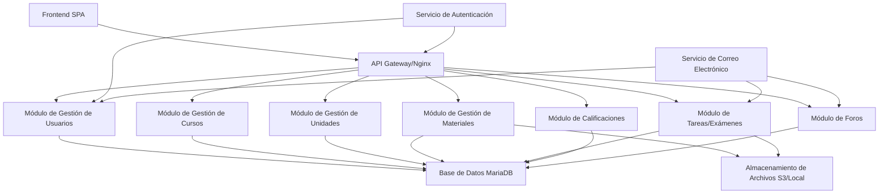

# Informe del Proyecto: Aplicación Web al Estilo de Moodle para Gestión de Estudiantes

## 1. Análisis de Requisitos

### Requisitos Funcionales
Basado en el concepto de sistema de gestión de aprendizaje (LMS) al estilo de Moodle, la aplicación debe apoyar flujos de trabajo educativos principales. Los requisitos funcionales se categorizan por roles de usuario y procesos clave.

- **Gestión de Usuarios**:
  - Registro: Los usuarios (estudiantes, profesores, administradores) se registran con correo electrónico, contraseña y detalles personales (nombre, institución). La validación de correo electrónico es obligatoria para prevenir cuentas falsas.
  - Autenticación: Inicio de sesión seguro usando nombre de usuario/correo electrónico y contraseña. Soporte para autenticación de dos factores (2FA) usando TOTP (Contraseña de Un Solo Uso Basada en Tiempo) para mayor seguridad.
  - Acceso Basado en Roles: Tres roles principales – Estudiantes (ver/inscribirse en cursos, acceder a materiales, enviar tareas), Profesores (crear/gestionar cursos, subir materiales, calificar trabajos), Administradores (gestionar usuarios, supervisar el sistema).
  - Gestión de Perfil: Los usuarios actualizan información personal, cambian contraseñas y gestionan configuraciones de 2FA.

- **Gestión de Cursos**:
  - Creación de Cursos: Los profesores crean cursos con títulos, descripciones, horarios y límites de inscripción.
  - Colaboradores: Los profesores pueden agregar otros docentes como colaboradores del curso.
  - Proceso de Inscripción: Los estudiantes navegan y solicitan inscripción; profesores/administradores/colaboradores aprueban las solicitudes. El estado de inscripción puede ser: pendiente, aprobado o rechazado.
  - Visualización de Cursos: Listas de cursos disponibles e inscritos, con búsqueda y filtrado.
  - Pausar/Reanudar Cursos: Los profesores pueden pausar cursos para ocultarlos temporalmente a los estudiantes.
  - Gestión de Participantes: Los profesores pueden ver y gestionar las inscripciones de estudiantes.

- **Gestión de Unidades**:
  - Creación de Unidades: Los profesores y colaboradores pueden crear unidades dentro de los cursos (sin límite de unidades).
  - Características: Cada unidad tiene título, descripción y orden dentro del curso.
  - Pausar Unidades: Los docentes pueden pausar unidades para ocultarlas temporalmente a los estudiantes.
  - Organización: Las unidades organizan el contenido del curso de manera estructurada.
  - Materiales y Tareas: Los materiales y tareas se asocian a unidades específicas.

- **Acceso a Materiales y Subidas de Archivos**:
  - Subir Materiales: Los profesores suben documentos, videos, enlaces, etc., con metadatos (título, descripción).
  - Reglas de Visibilidad: Establecer niveles de acceso – público (todos los usuarios), inscrito (participantes del curso), privado (usuarios/grupos específicos).
  - Control de Acceso: Los estudiantes ven/descargan materiales basados en permisos; profesores editan/borran.

- **Tareas y Exámenes**:
  - Creación: Los profesores crean tareas/exámenes dentro de unidades, con fechas límite, fecha final opcional, instrucciones y configuración de trabajo en grupo.
  - Envío de Trabajos: Los estudiantes pueden subir documentos (PDF, Office, Canva) con un comentario opcional inicial. El sistema maneja versionado de entregas (cada nueva entrega crea una nueva versión sin eliminar las anteriores).
  - Trabajo en Grupo: Los profesores pueden habilitar trabajo en grupo, permitiendo que los estudiantes agreguen colaboradores a sus entregas.
  - Control de Fechas: El sistema marca entregas fuera de término y puede establecer una fecha final después de la cual no se permiten más entregas.
  - Sistema de Feedback: Los profesores pueden proporcionar retroalimentación y solicitar reentregas. El estado refleja si una entrega requiere reentrega.
  - Previsualización de Archivos: Los docentes pueden previsualizar archivos directamente en el navegador o descargarlos.
  - Sistema de Comentarios: Los estudiantes y docentes pueden agregar comentarios a las entregas, creando un hilo de conversación tipo chat/foro. Los comentarios soportan respuestas anidadas.
  - Gestión de Versiones: Los docentes pueden ver todas las versiones de una entrega para comparar el progreso del estudiante.

- **Sistema de Calificaciones**:
  - Cálculo de Calificaciones: Computación automática de promedios, puntuaciones ponderadas y calificaciones finales.
  - Visualización: Los estudiantes acceden a calificaciones individuales y de curso; profesores ven el rendimiento de la clase.

- **Características Adicionales**:
  - Notificaciones: Alertas para fechas límite, calificaciones, nuevos materiales.
  - Búsqueda y Navegación: Búsqueda global para cursos, materiales, usuarios.
  - Foros: Foros dedicados para cada curso o materia, así como foros separados para cada unidad, para facilitar la discusión y el intercambio de ideas entre estudiantes y profesores de manera organizada.

### Requisitos No Funcionales
- **Rendimiento**: Manejar 1,000+ usuarios concurrentes con tiempos de respuesta bajo 2 segundos para la mayoría de operaciones.
- **Seguridad**: Proteger contra amenazas comunes; asegurar integridad y confidencialidad de datos.
- **Usabilidad**: Interfaz intuitiva, responsiva accesible en escritorio/móvil; soporte para múltiples idiomas.
  - Diseño Responsivo: Mobile-first con Bootstrap/Tailwind.
  - Navegación Intuitiva: Dashboards, breadcrumbs, búsqueda global.
  - Notificaciones: In-app y email para actualizaciones.
  - Seguimiento de Progreso: Barras de progreso visuales para cursos/tareas.
  - Accesibilidad: Cumplimiento WCAG 2.1, soporte para lectores de pantalla.
  - Mecanismos de Retroalimentación: Encuestas, integración de helpdesk.
- **Escalabilidad**: Diseño modular para agregar características/usuarios sin rework mayor.
- **Fiabilidad**: 99.9% uptime, con mecanismos de respaldo y recuperación.
- **Cumplimiento**: Adherirse a leyes de protección de datos como GDPR (si aplica para la base de usuarios).
- **Mantenibilidad**: Código limpio, documentación y pruebas automatizadas.

## 2. Diseño de Arquitectura
Se propone una arquitectura modular, inspirada en microservicios para asegurar escalabilidad, mantenibilidad y despliegue independiente de características. Cada módulo es una aplicación/componente separada, interactuando vía APIs RESTful y una base de datos compartida para consistencia de datos.

### Componentes de Alto Nivel
- **Frontend**: Aplicación de página única (SPA) para interacciones de usuario.
- **Módulos Backend**: Servicios separados para cada dominio (ej. gestión de usuarios como una app Django).
- **Base de Datos**: Base de datos relacional centralizada para datos compartidos.
- **Servicio de Autenticación**: Maneja inicio de sesión, 2FA y gestión de sesiones.
- **Almacenamiento de Archivos**: Almacenamiento seguro para subidas, integrado con backend.
- **API Gateway/Proxy Inverso**: Enruta solicitudes, maneja SSL y balanceo de carga.
- **Servicios Externos**: Correo electrónico para notificaciones, posiblemente terceros para 2FA.

### Interacciones de Módulos
- Los módulos se comunican vía APIs HTTP (REST) para acoplamiento suelto.
- Base de Datos Compartida: MariaDB para datos relacionales; módulos consultan/actualizan vía ORM.
- Orientado a Eventos: Usar colas de mensajes (ej. RabbitMQ) para tareas asíncronas como notificaciones.
- Manejo de Archivos: Subidas directas a almacenamiento, metadatos almacenados en DB.

### Diagrama de Alto Nivel

Esta arquitectura permite escalado horizontal de módulos y actualizaciones fáciles.

## 3. Desglose de Módulos
Cada módulo es una unidad autocontenida con responsabilidades y dependencias definidas.

- **Módulo de Gestión de Usuarios**:
  - Responsabilidades: Registro de usuarios, autenticación, gestión de perfil, asignación de roles.
  - Dependencias: Ninguna (módulo core).
  - Tecnologías: App Django con API REST.
  - **Implementación Completada**:
    - Serializers: UserSerializer, UserRegistrationSerializer, UserLoginSerializer, UserUpdateSerializer, ChangePasswordSerializer, TwoFactorSetupSerializer, TwoFactorVerifySerializer con validación completa.
    - Vistas: RegisterView, LoginView (con soporte 2FA), LogoutView, TwoFactorSetupView, TwoFactorVerifyView, ProfileView, ChangePasswordView, UserListView, UserDetailView.
    - URLs: Endpoints RESTful para todas las operaciones de usuario (/api/auth/).
    - Seguridad: JWT authentication, django-axes para protección contra fuerza bruta, django-ratelimit para limitación de tasa, django-auditlog para logging de auditoría, django-redis para caché.
    - Pruebas: Cobertura completa con 350+ líneas de tests unitarios incluyendo autenticación, gestión de perfil, 2FA, seguridad y administración.

- **Módulo de Gestión de Cursos**:
  - Responsabilidades: Creación de cursos, inscripción, visualización, gestión de colaboradores, aprobación de inscripciones, pausar/reanudar cursos.
  - Dependencias: Gestión de Usuarios (para roles/permisos).
  - Tecnologías: App Django.
  - **Implementación Completada**:
    - Modelos: Course (con colaboradores ManyToMany, is_paused), Enrollment (con estados: pending, approved, rejected).
    - Vistas: CRUD completo para cursos, gestión de inscripciones (aprobar/rechazar/cancelar), gestión de colaboradores, vistas diferenciadas para estudiantes y profesores.
    - Formularios: CourseForm con soporte para colaboradores.
    - Templates: Vistas personalizadas para listado de cursos, creación/edición, detalle con gestión de inscripciones y colaboradores.
    - Permisos: Los colaboradores pueden ver y aprobar inscripciones pero no editar/eliminar/pausar cursos.

- **Módulo de Asistencia**:
  - Responsabilidades: Toma de asistencia por fecha, edición posterior, informes por rango, exportes, y vista individual del estudiante.
  - Dependencias: Gestión de Cursos, Gestión de Usuarios.
  - Tecnologías: App Django con templates.
  - **Implementación Completada**:
    - Modelos: AttendanceSession (por curso/fecha) y AttendanceRecord (presente/ausente/media falta con nota).
    - Vistas: Toma de asistencia, informe resumen, informe completo con fechas, y detalle por estudiante.
    - Permisos: Solo instructor/colaboradores/admin pueden gestionar y ver informes; estudiantes solo ven su asistencia.
    - Exportes: PDF y Excel con opción de resumen o completo.

- **Módulo de Gestión de Unidades**:
  - Responsabilidades: Creación de unidades dentro de cursos, organización del contenido, gestión de visibilidad (pausar/reanudar).
  - Dependencias: Gestión de Cursos, Gestión de Usuarios.
  - Tecnologías: App Django.
  - **Implementación Completada**:
    - Modelos: Unit (con relación a Course, created_by, is_paused, order).
    - Vistas: CRUD completo para unidades, integración con materiales y tareas.
    - Formularios: UnitForm para crear y editar unidades.
    - Templates: Vistas para listado, creación/edición y detalle de unidades.
    - Permisos: Solo instructores y colaboradores pueden gestionar unidades.

- **Módulo de Gestión de Materiales**:
  - Responsabilidades: Subidas de archivos y enlaces, control de acceso, configuraciones de visibilidad, asociación a unidades, publicación programada y notificaciones por correo.
  - Dependencias: Gestión de Cursos, Gestión de Unidades, Gestión de Usuarios.
  - Tecnologías: Django con bibliotecas de manejo de archivos.
  - **Implementación Completada**:
    - Modelos: Material (con relación a Unit y Course, soporte para archivos y enlaces externos, nombres serializados para archivos; is_published, scheduled_publish_at, send_notification_email para publicación programada y correos).
    - Vistas: CRUD de materiales, carga de materiales en unidades, descarga de archivos, previsualización. Filtrado por is_published para alumnos.
    - Formularios: MaterialUploadForm, MaterialEditForm con validación de tipos de archivo y tamaño, y campos de publicación (publicar ahora, programar fecha/hora, enviar correo).
    - Templates: Vistas personalizadas para listado y gestión de materiales; formularios con sección “Publicación” para programar y notificar.
    - Seguridad: Validación de extensiones y tamaño de archivos, nombres serializados para almacenamiento seguro.
    - Publicación: El docente puede publicar de inmediato o programar la publicación; opción de enviar correo a los alumnos inscritos cuando se publique (vía cron + core.notifications.notify_material_published).

- **Módulo de Tareas/Exámenes**:
  - Responsabilidades: Crear/enviar/calificar tareas/exámenes, gestión de entregas con versionado, trabajo en grupo, feedback y reentregas, sistema de comentarios, publicación programada y notificaciones por correo.
  - Dependencias: Gestión de Cursos, Gestión de Unidades, Gestión de Usuarios.
  - Tecnologías: Django.
  - **Implementación Completada**:
    - Modelos:
      - Assignment: Tareas dentro de unidades con fechas límite, fecha final, trabajo en grupo opcional; is_published, scheduled_publish_at, send_notification_email para publicación programada y correos.
      - AssignmentSubmission: Entregas de estudiantes con versionado, estados (pending, submitted, returned, resubmitted), feedback del docente.
      - AssignmentCollaborator: Colaboradores para trabajo en grupo.
      - AssignmentComment: Sistema de comentarios/chat para cada entrega con soporte para respuestas anidadas.
    - Vistas: CRUD completo de tareas, carga de entregas, gestión de feedback, previsualización de archivos, gestión de colaboradores, sistema de comentarios. Filtrado por is_published para alumnos.
    - Formularios: AssignmentForm (con publicación programada y envío de correo), SubmissionForm (con comentario inicial), FeedbackForm, CollaboratorForm, CommentForm.
    - Templates: Vistas diferenciadas para estudiantes y profesores, gestión de versiones, sistema de comentarios tipo chat/foro; formulario de tareas con sección “Publicación”.
    - Características:
      - Versionado: Cada entrega crea una nueva versión sin eliminar las anteriores.
      - Trabajo en Grupo: Los estudiantes pueden agregar colaboradores si el profesor lo permite.
      - Feedback y Reentregas: Los docentes pueden solicitar reentregas y proporcionar retroalimentación.
      - Sistema de Comentarios: Chat/foro para comunicación sobre cada entrega entre estudiantes, colaboradores y docentes.
      - Previsualización: Los docentes pueden previsualizar archivos directamente en el navegador.
      - Control de Fechas: Marcado de entregas fuera de término y fecha final opcional.
      - Publicación: El docente puede publicar de inmediato o programar la publicación; opción de enviar correo a los alumnos inscritos cuando se publique (vía cron + core.notifications.notify_assignment_published).

- **Módulo de Calificaciones**:
  - Responsabilidades: Calcular y mostrar calificaciones.
  - Dependencias: Módulo de Tareas/Exámenes, Gestión de Usuarios.
  - Tecnologías: Django con lógica de cálculo.

- **Módulo de Foros**:
  - Responsabilidades: Crear y gestionar foros por curso y unidad, publicar mensajes, moderar discusiones.
  - Dependencias: Gestión de Cursos, Gestión de Usuarios.
  - Tecnologías: Django.

Este desglose asegura modularidad; nuevos módulos pueden agregarse sin afectar otros.

## 4. Recomendaciones de Stack Tecnológico
Comenzando con Django y MariaDB como sugerido, evaluado para ajuste.

- **Backend**: Django (Python) – Framework full-stack con ORM, autenticación e interfaz de admin. Adecuado para desarrollo rápido de LMS. Alternativa: FastAPI para mayor rendimiento si demandas de escalabilidad aumentan.
- **Base de Datos**: MariaDB – Open-source, compatible con MySQL, confiable para datos relacionales. Alternativa: PostgreSQL para características avanzadas como soporte JSON si necesario.
- **Frontend**: React – Basado en componentes, eficiente para SPAs, bueno para interfaces dinámicas de LMS. Alternativa: Vue.js para curva de aprendizaje más simple.
- **Despliegue/Containerización**: Docker y Docker Compose para portabilidad. Kubernetes para escalado en producción.
- **Otras Herramientas**: Nginx para proxy inverso, Redis para caché/sesiones, Celery para tareas asíncronas.
- **Justificación**: Django reduce boilerplate para características de usuario/auth. MariaDB es costo-efectivo y familiar. React asegura UX responsiva. Alternativas elegidas para mejor escalabilidad/seguridad si la base de usuarios crece más allá de estimaciones iniciales.

## 5. Medidas de Seguridad
Seguridad integral para proteger usuarios y datos.

- **Autenticación**: Hashing de contraseñas (bcrypt), validación de correo electrónico, 2FA (TOTP vía bibliotecas como django-otp).
- **Autorización**: Control de Acceso Basado en Roles (RBAC) con permisos (ej. estudiantes no pueden editar cursos).
- **Encriptación de Datos**: TLS 1.3 para transporte, AES-256 para datos sensibles en reposo.
- **Prevención de Ataques**: Validación/sanitización de entrada, tokens CSRF, limitación de tasa (ej. vía Nginx), protección contra inyección SQL vía ORM.
- **Subidas de Archivos Seguras**: Validación de tipo/tamaño de archivo, escaneo de virus, almacenamiento en directorios aislados.
- **Cumplimiento**: Adherirse a guías OWASP, auditorías de seguridad regulares.
- **Limitación de Tasa**: Implementar en APIs para prevenir DDoS.
- **Logging de Auditoría**: Loggear todas las acciones de usuario para forense.
- **Pruebas de Penetración**: Pruebas trimestrales por expertos.
- **Codificación Segura**: Revisiones de código obligatorias, uso de bibliotecas de seguridad.
- **Monitoreo**: Alertas en tiempo real vía herramientas como ELK stack o Prometheus.

## 6. Protección de Datos
Enfoque en privacidad y cumplimiento legal.

- **Manejo de Datos Personales**: Recopilar datos mínimos (nombre, correo electrónico, calificaciones); consentimiento de usuario requerido para procesamiento.
- **Políticas de Privacidad**: Políticas claras, accesibles con opciones de opt-out.
- **Retención de Datos**: Retener datos según necesario (ej. calificaciones indefinidamente para transcripciones), borrar a solicitud de usuario o expiración legal.
- **Medidas de Protección**: Encriptación, logs de acceso, anonimización para analytics.
- **Cumplimiento GDPR**: Portabilidad de datos, derecho a borrado, notificación de brechas.

## 7. Plan de Despliegue
Usando Docker Compose para entornos.

- **Entornos**: Producción (www.sverina.com.ar), Prueba/Dev (dev.sverina.com.ar).
- **Configuración Docker Compose**:
  - Servicios: Uno por módulo (apps Django), MariaDB, Nginx (proxy inverso), Redis (opcional).
  - Redes: Internas para módulos, puertos expuestos para Nginx.
  - Volúmenes: Persistentes para DB y almacenamiento de archivos.
- **Certificados SSL**: Let's Encrypt vía Certbot para HTTPS automático.
- **Variables de Entorno**: Almacenar secretos (contraseñas DB, claves API) en archivos .env, no en código.
- **CI/CD**: GitHub Actions para pruebas automatizadas, construcción de imágenes y despliegue a servidores.

## 8. Estado de Implementación

### Módulos Implementados y Funcionalidades

- **Módulo de Gestión de Usuarios**: ✅ Completado
  - Sistema de autenticación con 2FA
  - Gestión de perfiles
  - Control de acceso basado en roles
  - Autoregistro de alumnos con verificación de email vía Mailgun
  - Enlace de verificación con expiración y cooldown para reenvío
  - Bloqueo de acceso para alumnos no verificados con pantalla de aviso

- **Módulo de Gestión de Cursos**: ✅ Completado
  - CRUD completo de cursos
  - Sistema de inscripciones con aprobación
  - Gestión de colaboradores
  - Pausar/reanudar cursos
  - Vistas diferenciadas para estudiantes y profesores

- **Módulo de Asistencia**: ✅ Completado
  - Toma de asistencia por fecha con edición posterior
  - Estados: presente, ausente, media falta con nota obligatoria
  - Informe por rango con porcentajes y equivalentes
  - Exportes PDF/Excel (resumen o completo)
  - Vista individual del estudiante con notas

- **Módulo de Gestión de Unidades**: ✅ Completado
  - CRUD completo de unidades dentro de cursos
  - Organización del contenido del curso
  - Sistema de pausar/reanudar unidades
  - Integración con materiales y tareas

- **Módulo de Gestión de Materiales**: ✅ Completado
  - Carga de archivos y enlaces
  - Asociación a unidades
  - Nombres serializados para seguridad
  - Validación de tipos de archivo y tamaño
  - Control de acceso basado en permisos
  - Edición y eliminación de materiales desde el perfil docente
  - Borrado automático de archivos asociados al eliminar o reemplazar
  - **Publicación y programación**: El docente elige si el material está disponible para alumnos (is_published), puede programar la publicación (scheduled_publish_at, p. ej. lunes 8:00) y optar por enviar correo a los alumnos inscritos al publicarse (send_notification_email). Publicación inmediata o por cron cada minuto. Zona horaria America/Argentina/Buenos_Aires.

- **Módulo de Tareas/Exámenes**: ✅ Completado
  - CRUD completo de tareas dentro de unidades
  - Sistema de entregas con versionado
  - Trabajo en grupo con colaboradores
  - Sistema de feedback y reentregas
  - Sistema de comentarios/chat para cada entrega
  - Previsualización de archivos
  - Control de fechas límite y fecha final
  - Marcado de entregas fuera de término
  - Edición y eliminación de tareas desde el perfil docente
  - Aviso de borrado de entregas con eliminación de archivos asociados
  - **Publicación y programación**: El docente elige si la tarea está disponible para alumnos (is_published), puede programar la publicación (scheduled_publish_at) y optar por enviar correo a los alumnos inscritos al publicarse (send_notification_email). Misma lógica de cron y zona horaria que en materiales.

- **Módulo de Calificaciones**: ⏳ Pendiente

- **Módulo de Foros**: ⏳ Pendiente

- **Módulo de Monitoreo de Almacenamiento**: ✅ Completado
  - Sistema de monitoreo de uso del bucket Oracle OCI
  - Vista en dashboard del administrador con estadísticas en tiempo real
  - Modelo de configuración (StorageConfig) para gestionar umbrales de alerta
  - Cálculo automático del uso de almacenamiento (caché de 5 minutos)
  - Sistema de alertas por email cuando se alcanza el umbral configurado
  - Configuración ajustable de espacio total (GB) y umbral de alerta (%)
  - Verificación automática del umbral al subir archivos (Material y AssignmentSubmission)
  - Prevención de spam de alertas (máximo una alerta cada 24 horas)
  - Vista detallada en el admin de Django con estadísticas y gráficos
  - Integración con Mailgun para notificaciones
  - Visualización con barra de progreso y colores según el nivel de uso (verde/amarillo/rojo)

### Configuración y Despliegue

- **Docker Compose**: ✅ Configurado
  - Servicios: MariaDB, Django Web
  - Redes: Integración con Nginx Proxy Manager
  - Volúmenes persistentes para base de datos y archivos
  - Volumen montado del bucket Oracle OCI para almacenamiento de archivos media

- **Base de Datos**: ✅ MariaDB 10.11
  - Migraciones configuradas para todos los módulos
  - Relaciones entre modelos establecidas

- **Frontend**: ✅ Templates Django
  - Interfaz en español
  - Diseño responsive con Bootstrap
  - Vistas personalizadas para cada módulo

- **Seguridad**: ✅ Implementada
  - CSRF protection configurado
  - CSRF_TRUSTED_ORIGINS para proxy reverso
  - SECURE_PROXY_SSL_HEADER configurado
  - Validación de archivos y tipos
  - Control de acceso basado en roles

- **Despliegue en Producción**: ✅ Configurado
  - Dominio: marinaojeda.ar / www.marinaojeda.ar
  - SSL: Let's Encrypt via Nginx Proxy Manager
  - Proxy Reverso: Nginx Proxy Manager
  - Certificados SSL activos

### Tecnologías Utilizadas

- **Backend**: Django 5.2.7 (Python 3.11)
- **Base de Datos**: MariaDB 10.11
- **Frontend**: Templates Django con Bootstrap
- **Containerización**: Docker y Docker Compose
- **Proxy Reverso**: Nginx Proxy Manager
- **SSL**: Let's Encrypt
- **ORM**: Django ORM
- **Autenticación**: django-otp para 2FA

### Características Principales Implementadas

1. **Sistema de Roles**: Estudiantes, Profesores, Administradores
2. **Gestión de Cursos**: CRUD completo con colaboradores e inscripciones
3. **Gestión de Unidades**: Organización del contenido del curso
4. **Gestión de Materiales**: Archivos y enlaces con control de acceso
5. **Sistema de Tareas**: Tareas con entregas, versionado, feedback y comentarios
6. **Trabajo en Grupo**: Colaboradores en tareas
7. **Sistema de Comentarios**: Chat/foro para comunicación sobre entregas
8. **Control de Acceso**: Permisos granulares basados en roles
9. **Versionado**: Sistema de versiones para entregas de tareas
10. **Feedback y Reentregas**: Sistema completo de retroalimentación
11. **Monitoreo de Almacenamiento**: Sistema completo de monitoreo del bucket Oracle OCI con alertas configurables y visualización en dashboard del administrador
12. **Asistencia**: Toma por fecha, reportes con porcentajes, exportes y notas por estudiante
13. **Publicación programada de materiales y tareas**: El docente puede dejar material/tarea no visible y programar fecha y hora de publicación (ej. lunes 8:00, zona Argentina/Buenos Aires). Cron ejecuta cada minuto `publish_scheduled_content`; al publicar se puede enviar correo a los alumnos inscritos. Componentes: `run_publish_scheduled.py`, `manage.py publish_scheduled_content`, `core.notifications.notify_material_published` y `notify_assignment_published`, templates de correo, `input_formats` para `datetime-local` y `make_aware` en formularios.